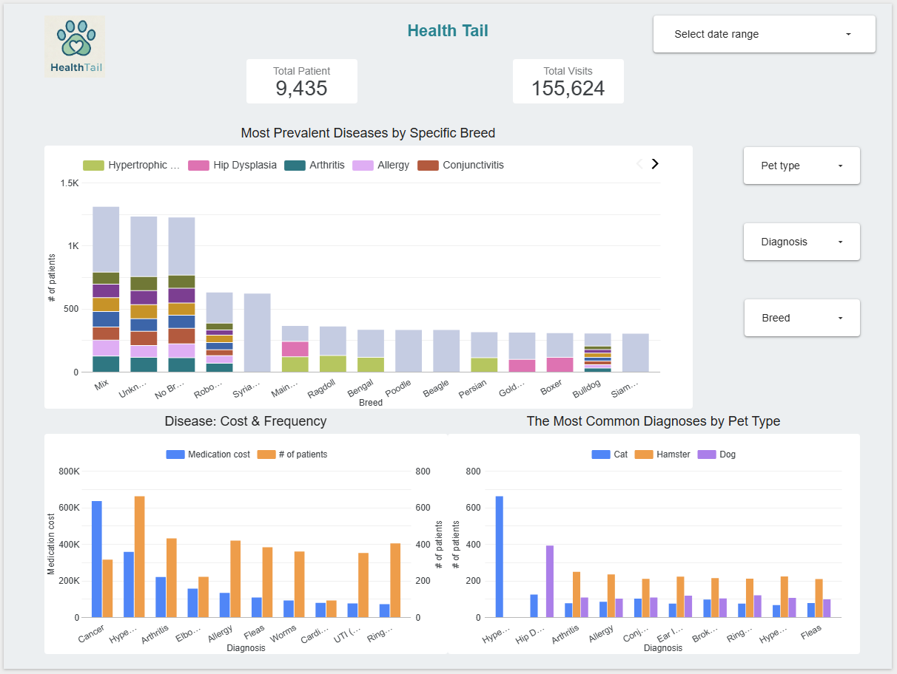

# HealthTail BI Solution: End-to-End Analytics Project

## 📄 Project Overview

This project is a comprehensive Business Intelligence solution for **HealthTail**, a large veterinary hospital. The goal is to automate their medication auditing process and analyze disease trends among patients.

The project transforms raw `.csv` data into an interactive **Looker Studio dashboard** by leveraging Google Cloud Platform (GCP) services. It demonstrates a complete end-to-end data workflow: from data ingestion and transformation in **BigQuery** to final visualization.

---

## 🚀 Core Business Problems

HealthTail faced two key challenges that this project addresses:

1.  **Auditing Medication Expenses:** The need for a streamlined way to track and analyze annual spending on medications.
2.  **Monitoring Disease Trends:** The desire to identify common diagnoses to optimize staffing and medication procurement, with segmentation by pet type and breed.

---

## 🛠️ Tech Stack & Architecture

* **Cloud Provider:** Google Cloud Platform (GCP)
* **Data Warehouse:** Google BigQuery
* **BI & Visualization:** Looker Studio

The project follows a modern data stack architecture where data flows from the source files to the final dashboard.

---

## 📊 Data Model & Solution

To address the business problems, a data pipeline was created to produce two key analytical tables:

1.  **`med_audit` Table:** This table directly solves the **Auditing Medication Expenses** problem. It consolidates data from purchases (`invoices`) and patient usage (`visits`) to create a comprehensive ledger of all medication movements (`stock in` / `stock out`), tracking total packs and costs per month.

2.  **`visits_cleaned` Table:** This table is the foundation for solving the **Monitoring Disease Trends** problem. It enriches the raw `visits` data by joining it with cleaned patient information from `registration_clean`. This creates a unified view containing diagnoses, patient types, and breeds in a single place, making it the perfect data source for the Looker Studio dashboard.

---

## 🔗 Live Dashboard & Detailed Analysis

An interactive Looker Studio dashboard was developed to visualize the findings from the `visits_cleaned` table.

> **[➡️ View the Interactive Looker Studio Report](СЮДА_ВСТАВЬТЕ_ВАШУ_ССЫЛКУ)**

> **[➡️ Click here for a detailed breakdown of the dashboard and key findings](docs/Dashboard_Analysis.md)**

---

## 📂 Repository Structure

This repository is organized as follows:

* **/data/raw**: Contains the source `.csv` files used for the analysis.
* **/data/processed**: Contains the final datasets created by the SQL scripts (e.g., `med_audit.csv`).
* **/docs**: Contains all project documentation, including the detailed analysis (`Dashboard_Analysis.md`), architecture diagram, and screenshots.
* **/sql/1_schemas**: (Currently unused) Intended for DDL scripts for table creation.
* **/sql/2_transformations**: Contains the main ETL script (`01_clean_and_aggregate_data.sql`) for cleaning, transforming, and creating all necessary tables.
* **/sql/3_analysis**: Contains the analytical queries (`02_business_questions_analysis.sql`) used to answer business questions.
* **README.md**: Project overview (this file).
