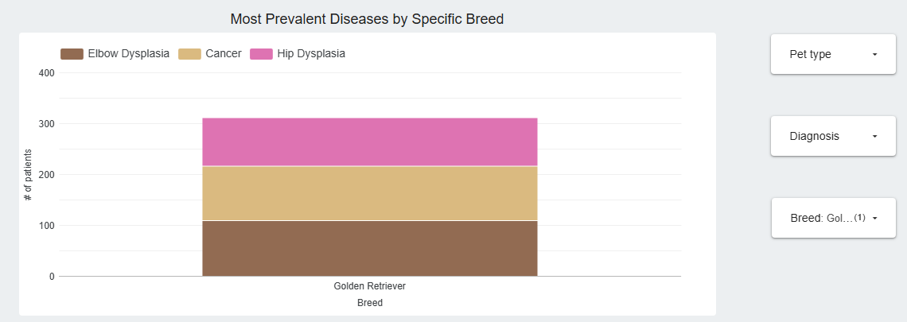
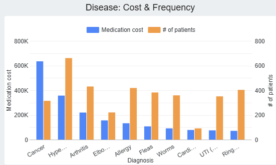
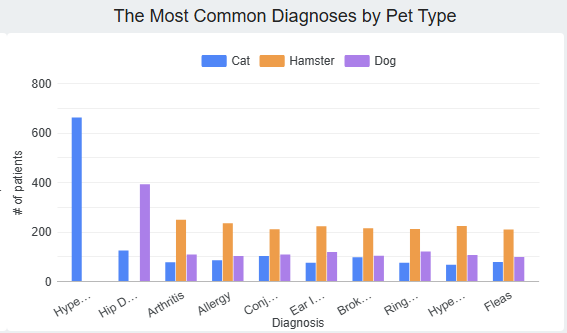
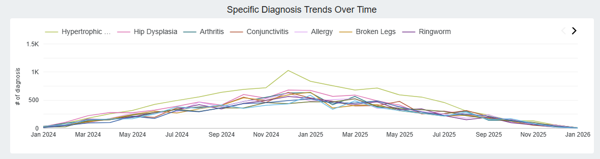
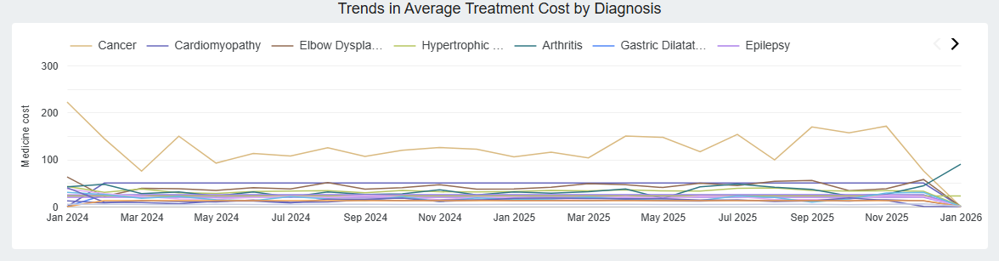

# Dashboard Analysis & Key Findings

### Introduction
We were approached by HealthTail, a large veterinary hospital. Their priority became an analysis of the most common diseases among their patients – segmented by type and breed – to optimize staffing and medication procurement processes. Today, we are presenting the key findings of this analysis.

### Dashboard Overview & Interactivity

**[➡️ View the Full Interactive Dashboard Here](https://lookerstudio.google.com/reporting/2ee942e6-b8f9-43f1-98a1-f98f33bad7d3)**

This dashboard displays key characteristics of the hospital's operations: from early 2024 through May 2026, HealthTail has cared for nearly 9,500 tailed patients and handled over 155,500 visits. To help you explore this data, the dashboard is interactive. You'll find dropdown filters allowing you to select specific time periods using the calendar, as well as filter by pet type, diagnosis of interest, or breed.

---

### Chart 1: Disease Prevalence by Breed
The first chart addresses the question: 'Which diseases are most prevalent among specific breeds?' You can use the dropdown menu alongside this chart to select a particular breed for a focused view. For example, Golden Retrievers are similarly prone to three conditions: elbow dysplasia, hip dysplasia, and cancer.

### Chart 2: Disease Costs vs. Frequency
The second chart focuses on: 'Which diseases incur the highest spending, and how frequently do they appear in the data?' We can see that cancer has the most expensive treatment, with hypertrophic cardiomyopathy in second place, and arthritis in third. However, hypertrophic cardiomyopathy occurs in our data twice as often as cancer.

### Chart 3: Top Diagnoses by Pet Type
The next chart presents the answer to the question: 'What are the most common diagnoses and diseases overall? How do they break down by pet type?' The chart shows that hypertrophic cardiomyopathy is the most prevalent disease among our patients, and it exclusively affects cats. Hip dysplasia is the second most common, occurring three times more frequently in dogs than in cats.

### Chart 4: Disease Trends Over Time
Moving on to our next dashboard. Here, the first chart provides an answer to the question: 'Is there an increase in diagnoses of certain types over time?' We observe that all Top 10 diseases peaked in December 2024 and January 2025. For this chart, you can use the dropdown menu to select a specific diagnosis and analyze its particular trend in more detail.

### Chart 5: Medication Spending Over Time
Finally, this last chart illustrates: 'How does spending on medications change over time?' We can observe significant spikes in the average cost of cancer treatment, while the treatment costs for other diagnoses have remained relatively stable. Additionally, there was a sharp spike in the average treatment cost for arthritis in January 2026.

---

### Conclusion
In conclusion, to address HealthTail management's request, we have developed a comprehensive analytical solution. This tool enables HealthTail to:
* Effectively monitor the most prevalent diagnoses among their patients.
* Clearly track disease prevalence across various animal breeds.
* Perform in-depth analysis of spending on specific medications associated with these identified conditions.

Therefore, this developed tool empowers HealthTail to make informed decisions, optimize procurement, and effectively plan resources.
